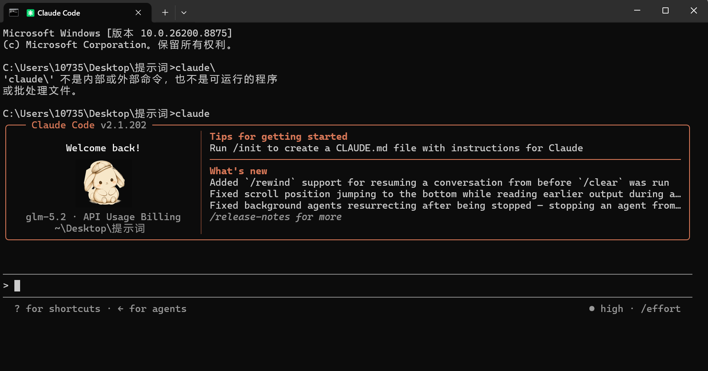

# Rabbit Code

Rabbit Code is an offline-first prompt engineering workspace for analyzing and optimizing prompts, managing templates, saving versions, reviewing diffs, and working through a CLI, local web UI, or Tauri desktop shell. The offline rules path needs no cloud API. OpenAI-compatible, Gemini, Anthropic, Azure, Vertex, and Bedrock paths are opt-in and require configuration.




## Support scope

- First-release targets: Windows 11 x64 and Ubuntu 24.04 x64.
- CPU-only offline rules are the minimum supported path.
- macOS is outside the first-release build, test, and support scope.
- Local models and cloud Providers are never bundled with the installer. The user chooses the model, license, and data boundary.
- The current package version is `3.0.0`; the `prompt_optimizer` Python module and `prompt-opt` command remain compatibility entry points.

See the [support matrix](docs/support-matrix.md) for the full scope and verification status.

## Features

- Score clarity, specificity, context, output format, constraints, role, examples, and executability.
- Generate offline rule suggestions or route to a configured model Provider.
- Manage technical, creative, business, education, and general-purpose templates.
- Store results in local SQLite with history, version diffs, and Markdown/JSON/TXT/CSV export.
- Use SSE streaming or background tasks; cancellation, failures, Provider fallback, and local-model recovery are surfaced in result metadata.
- Use workspace, task, change-review, terminal, Provider/model, prompt-asset, settings, and diagnostics views in the web UI.

## Install and quick start

### Requirements

- Python 3.12+
- Node.js 20.19+, only needed to develop or build the frontend
- Git
- Docker Desktop, optional for local development/testing

After cloning:

```bash
git clone <repository-url>
cd prompt-optimizer
python -m venv .venv
# Windows PowerShell
.venv\Scripts\Activate.ps1
# Linux
# . .venv/bin/activate
python -m pip install -e "backend[dev]"
```

Build and start the local workspace:

```bash
npm --prefix frontend install
npm --prefix frontend run build
rabbit serve --host 127.0.0.1 --port 8000
```

Open <http://127.0.0.1:8000>. On Windows, `start.bat local` runs the same local flow; `start.bat docker` uses Docker.

### Smallest CLI path

```bash
rabbit version
rabbit analyze "Explain machine learning in three bullet points."
rabbit optimize "Write a business email" --provider offline
rabbit templates list --category tech
rabbit history list
rabbit doctor --json
```

<!-- docs-check:run -->
```python
python scripts/check_docs.py
```

The compatibility group `rabbit prompt ...` is also supported. See the [user guide](docs/user-guide.md) for all command and UI workflows.

## Providers and local models

The default `offline` provider does not send prompts anywhere. A cloud Provider must be explicitly configured with an API key, model, and endpoint. Keys stay at the OS credential boundary or in the process environment; never put them in README files, logs, Issues, or screenshots. See the [Provider integration guide](docs/providers/provider-integration.md).

Local models require the user to install a runner, accept the model license, and provide enough disk/RAM. Model weights are not embedded in the installer. See the [local model guide](docs/providers/local-models.md).

## Data, privacy, and deletion

The default data directory is `%APPDATA%\rabbit-code` on Windows and `$XDG_DATA_HOME/rabbit-code` or `~/.local/share/rabbit-code` on Linux. Override it with `RABBIT_CODE_HOME` and `RABBIT_CODE_DB`. `PROMPT_OPTIMIZER_*` variables are migration-only compatibility names and emit deprecation warnings.

Prompt history, tasks, caches, logs, and Provider metadata may contain input-derived data. Do not send sensitive data to an unreviewed Provider. Telemetry is off by default; when enabled, only anonymous technical metadata is eligible, excluding prompts, files, credentials, request bodies, and responses. See [security, privacy, and deletion](docs/security/privacy-and-data.md).

## Development and quality checks

```bash
python scripts/check_docs.py
pytest backend/tests
ruff check backend
mypy backend/src
npm --prefix frontend test
npm --prefix frontend run lint
npm --prefix frontend run build
```

Performance numbers must come from [the baseline JSON](docs/performance/baseline.json) and its generation command, never from hand-edited README or release text.

Project entry points:

- [Architecture](docs/architecture/rabbit-code.md)
- [Development and release guide](docs/development-guide.md)
- [Contribution guide](docs/contribution.md)
- [Security policy](SECURITY.md)
- [Third-party notices](THIRD_PARTY_NOTICES.md)
- [RC traceability index](docs/traceability/rc-index.md)

## License

The source code is released under the [MIT License](LICENSE). Dependencies, models, and images may have separate terms. Read [third-party notices](THIRD_PARTY_NOTICES.md) and the local-model license records before distributing or importing assets.
