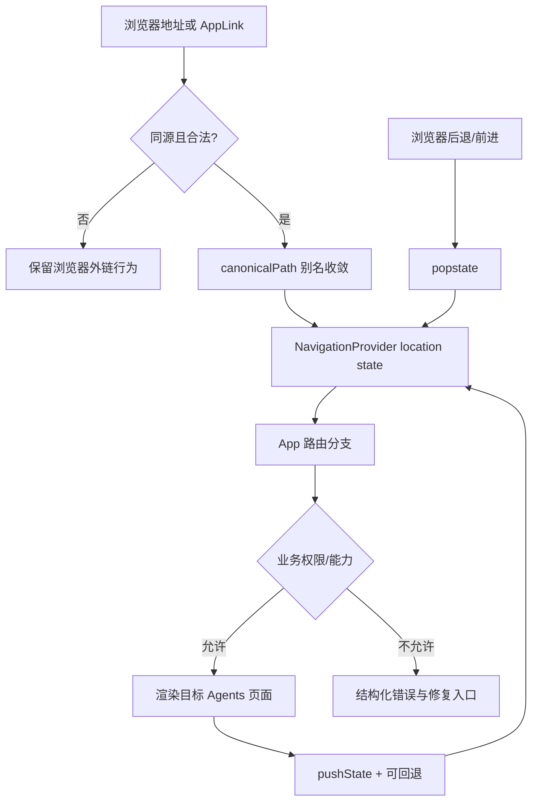

# Agents 导航架构

## 目标与边界

Agents 的导航只负责页面状态、同源路由、历史记录和可预测错误；Agent、Provider、权限和业务状态仍由各自服务/组件负责。公开说明页可以保留直达 URL，但 Agents 内部不再链接到旧的 prompt-management/evaluations/prompt-chaining 页面。

## 路由目录

| 路由 | 页面 | 权限/失败处理 |
| --- | --- | --- |
| `/onboarding` | API / 本地模型双入口 | guest 可用；服务不可用时显示检查状态 |
| `/workspace/home` | 项目与最近任务 | guest 可用；API 失败保留本地 recents |
| `/workspace` | Composer、优化、发送 | guest/local 可用；Provider 失败显示降级与修复动作 |
| `/workspace/task` | Agent 会话/终端/Inspector | 工具动作仍经后端权限策略 |
| `/workspace/review` | diff/checkpoint 审查 | 接受/拒绝/回滚保持当前页面 |
| `/workspace/providers` | Provider、模型、连接验证 | 凭据只显示 opaque 来源 |
| `/workspace/models` | Gemma/Qwen 生命周期 | 需要确认许可证和安装状态 |
| `/workspace/assets` | Prompt asset/history | 导入先校验；导出不发送网络 |
| `/workspace/settings` | 设置、权限、隐私、扩展 | 修改按 scope 和审批边界执行 |
| `/workspace/diagnostics` | 健康、日志预览、更新 | 只展示脱敏信息和可执行修复 |

旧路径 `/prompt-management`、`/evaluations`、`/prompt-chaining` 只做一次 `replaceState` 别名收敛，分别进入 assets、review、task；不会在两个路由间来回 push。

## 状态与流程

`NavigationProvider` 是唯一写入 history 的入口；`AppLink` 只拦截无修饰键的同源左键点击，Ctrl/Cmd/Shift/Alt、下载、`target=_blank` 和外链交回浏览器。未知公开路径仍由原说明页渲染 404，不重定向到历史站点；Agents 的旧路径则只进行一次 replace canonicalization。

## 错误、权限与响应式

- 页面导航失败不清空 prompt draft、session 或 optimization preview；业务错误由 `ErrorState` 和 recovery action 表达。
- 页面本身不授予工具权限。文件、终端、网络、Git、MCP 和 desktop 能力继续由后端 capability/approval policy 决定。
- workspace 链接保留 query（workspace、entry、template、project、task），路由状态变化不会丢失 scope。
- 紧凑视口使用同一 route catalog，不复制移动端路径；CSS 只改变布局，不改变导航语义。菜单有 Escape 关闭、焦点恢复和 reduced-motion 支持。
- 真实用户/屏幕阅读器/原生多窗口仍需平台发布矩阵；jsdom 只验证状态契约，Playwright 验证浏览器路径。

## 验收

实现：`frontend/src/navigation.tsx`；覆盖：`frontend/tests/Navigation.test.tsx`、现有 `RabbitRoutes`/`Rc234Workflow`/`Rc260Usability`/`Rc261Efficiency`。本轮还以 Vite 开发服务器和 Playwright CLI 验证 onboarding → workspace、旧路径别名、移动宽度和浏览器 console。
