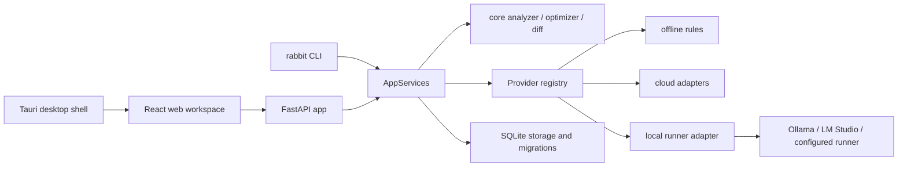

# Rabbit Code Architecture

This document describes the implementation in this repository. It is intentionally tied to source paths so a new contributor can follow one request without relying on a diagram alone.

## Process boundary



The Tauri project under `apps/desktop/src-tauri` owns the window and OS shell boundary. It must not contain Agent, Provider, prompt, session, or persistence business logic. The browser build can run through FastAPI; the desktop shell points at the built frontend through `tauri.conf.json`.

## One request

1. The CLI command in `backend/src/prompt_optimizer/cli/app.py` or the route in `backend/src/prompt_optimizer/api/app.py` validates the input.
2. `backend/src/prompt_optimizer/services.py` selects the analyzer, optimizer, Provider route, and storage services.
3. `core` computes the deterministic analysis and rule suggestions. A configured model receives a `ModelRequest` only through the Provider protocol.
4. `providers/registry.py` chooses the adapter from `ProviderConfig.api_protocol` and Provider name. Failures are classified in `providers/base.py`; the service may return the offline rule fallback with metadata.
5. `storage/service.py` and the migration layer save the version, task, audit, or workspace record. Export is performed by `export/portable.py` or the format-specific export service.
6. The API returns JSON or SSE. The UI updates Provider metadata, diff state, history, and recovery actions without implementing Provider logic itself.

## Agent loop and tools

The shared runtime lives under `backend/rabbit_code`. Its CLI entry points are exposed as `rabbit run` and `rabbit tui`; the prompt-optimization CLI remains in `backend/src/prompt_optimizer/cli`. An Agent execution is a stateful sequence of request, tool selection, permission check, tool execution, result redaction, and final response. Tool implementations are in the `rabbit_code` package and are not duplicated in React routes.

Every tool has a narrow boundary: process tools execute only after the permission/sandbox policy allows them, shell tools preserve an explicit working directory, search tools return bounded results, and tool results use the shared result contract. A failure is reported as structured data so the caller can cancel or recover rather than parsing arbitrary text.

## Protocol and data contracts

- Provider request/response types: `backend/src/prompt_optimizer/providers/base.py`.
- API DTOs and versioned contracts: `backend/src/prompt_optimizer/contracts.py` and `backend/src/prompt_optimizer/api/app.py`.
- Generated frontend API types: `frontend/src/generated/` and `scripts/generate_api.py`.
- Data-model contracts: `backend/src/prompt_optimizer/data_model.py`, `backend/migrations/`, and `scripts/generate_data_model.py`.
- State-changing operations are versioned by migration or explicit contract version. Do not hand-write a second frontend DTO when the generated contract exists.

## Provider boundary

The `ModelProvider` protocol exposes `optimize` and `stream`. The registry selects these native adapters:

| Protocol/name | Adapter | Important configuration |
| --- | --- | --- |
| `chat_completions` | `OpenAICompatibleAdapter` | `*_BASE_URL`, `*_API_KEY`, `*_MODEL` |
| `responses` | `OpenAIResponsesAdapter` | `*_API_PROTOCOL=responses` |
| `gemini` | `GeminiAdapter` | `GEMINI_API_KEY`, `GEMINI_MODEL` |
| `anthropic` | `AnthropicMessagesAdapter` | `ANTHROPIC_API_KEY`, `ANTHROPIC_MODEL` |
| `azure_openai` | `AzureOpenAIAdapter` | deployment, API version, `AZURE_BASE_URL` |
| `vertex` | `VertexAIAdapter` | project, region, model, bearer credential |
| `bedrock` | `BedrockConverseAdapter` | region, model, official SigV4 signer |
| `local` | `LocalModelProvider` | runner health and local model state |

The adapter owns wire-format translation, timeout/retry handling, cancellation checks, response extraction, and request-id sanitization. It must not write application history or bypass the credential boundary.

## Data and failure recovery

User data is local by default. `paths.py` resolves the application directory and database, `storage/migrations.py` upgrades the schema, and `retention.py` removes only records selected by the retention policy. `privacy.py` and `structured_logging.py` define redaction and telemetry boundaries.

Local model installation is resumable: `local_install.py` emits download, verify, install, and health states; `local_model_state.py` maps those events to UI lifecycle states; `model_lifecycle.py` registers checksummed versions and supports rollback, repair, cleanup, migration, and uninstall. A failed cloud request is categorized by auth, balance, rate limit, region, model, parameter, filter, network, timeout, or server class. The UI receives a recovery action rather than a raw secret-bearing exception.

## Desktop sidecar lifecycle

The desktop process builds the frontend first, then checks the Rust shell. The shell boundary is intentionally small:

```text
npm --prefix frontend run build
cargo check --manifest-path apps/desktop/src-tauri/Cargo.toml
```

Production packaging is not enabled by the current `tauri.conf.json`; RC-272 owns installer generation. This document therefore describes the boundary, not a claim that installers already exist.

## Related decisions

- [Desktop shell boundary](../adr/0007-desktop-shell-boundary.md)
- [Title-bar strategy](../adr/0012-title-bar-strategy.md)
- [Data model notes](../data-model/erd.md)
- [Development and release guide](../development-guide.md)
