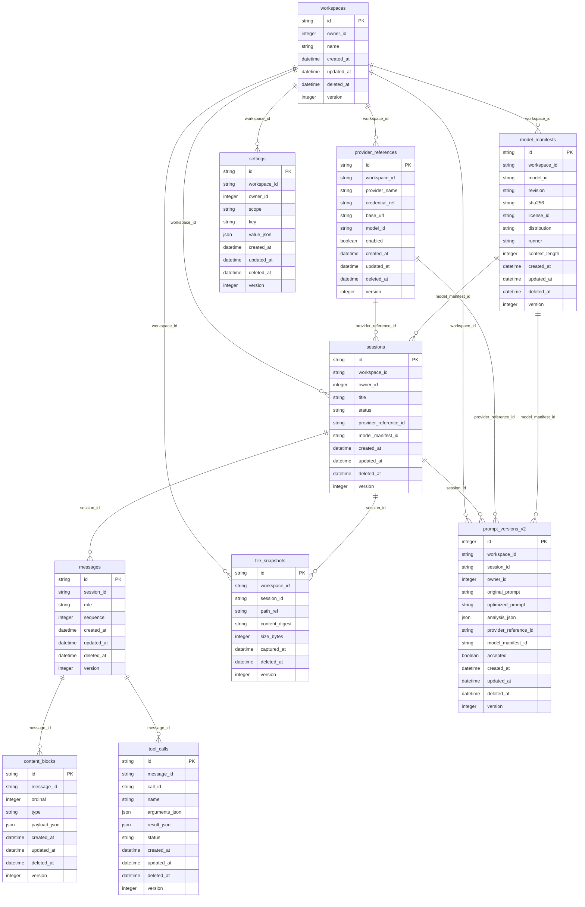

# Rabbit Code Core Data Model

<!-- Generated by scripts/generate_data_model.py; do not edit manually. -->
<!-- RC ID: RC-213. -->

## Lifecycle and deletion

Every entity has created_at, updated_at when mutable, a nullable deleted_at, and an integer version unless it is an immutable snapshot. Foreign-key cascades and SET NULL behavior are generated in the draft migration. credential_ref is an opaque SecretStore reference and path_ref is opaque or redacted; neither field stores the protected value by default.
